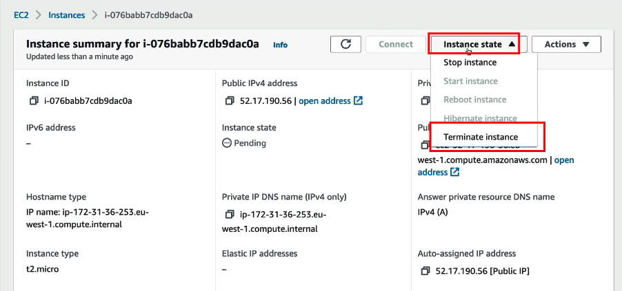
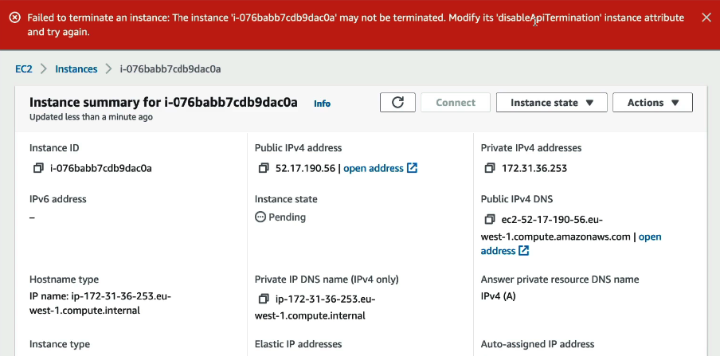
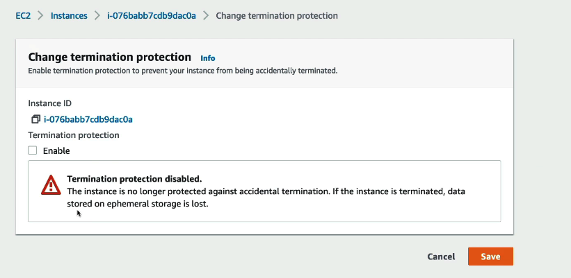
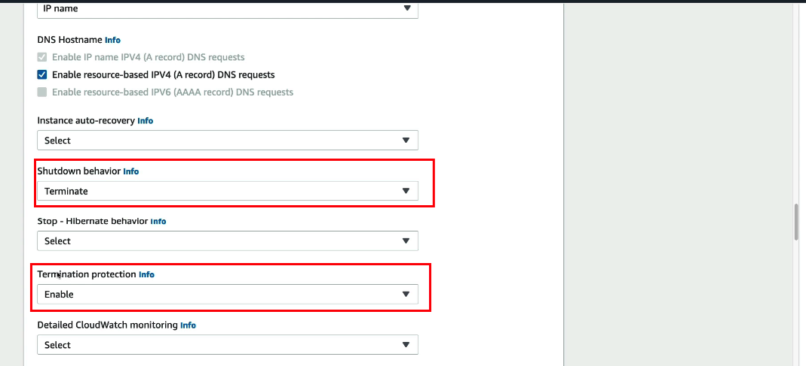
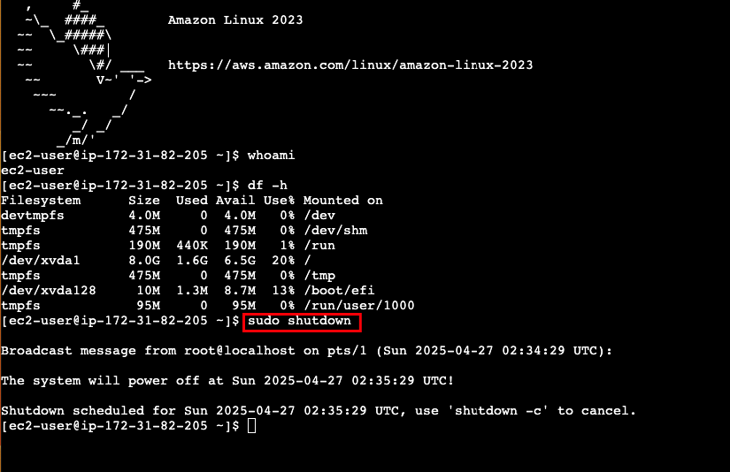
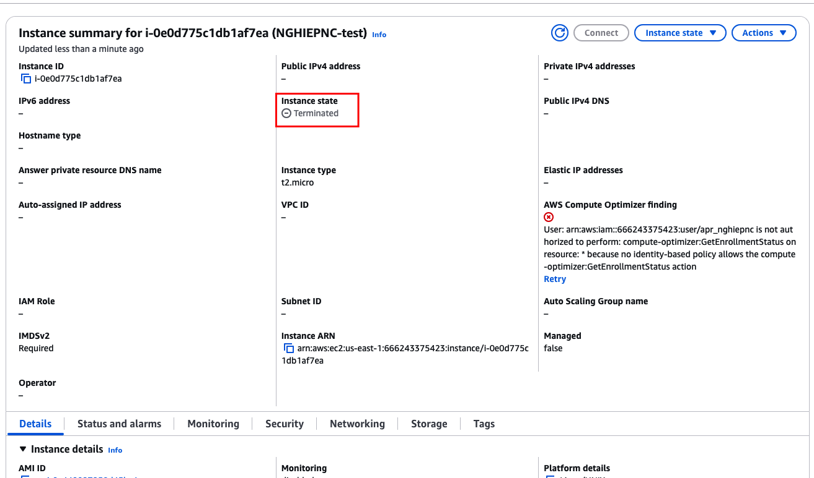

# EC2 Basics

This section covers fundamental EC2 concepts and operations that are essential for SysOps administrators. Each topic includes both theoretical understanding and practical hands-on exercises.

## Content Structure

### 1. Instance Management
- **1.1Changing EC2 Instance Type** (4 minutes)
  - **Lý do thay đổi loại phiên bản**:
    - Nâng cấp từ t2.micro lên t2.small để có thêm RAM và CPU
    - Tối ưu hóa hiệu suất ứng dụng
    - Đáp ứng nhu cầu tăng trưởng của ứng dụng
  
  - **Điều kiện thay đổi**:
    - Phiên bản phải sử dụng EBS (Elastic Block Store)
    - Phiên bản phải ở trạng thái dừng (stopped)
    - Có đủ quyền để thay đổi thuộc tính instance

  - **Quy trình thực hiện**:
    1. Dừng phiên bản EC2
    2. Thay đổi loại phiên bản thông qua:
       - Click chuột phải vào instance
       - Chọn "Change Instance Type"
       - Chọn loại phiên bản mới (ví dụ: t2.small)
    3. Khởi động lại phiên bản

  - **Lưu ý quan trọng**:
    - Một số loại phiên bản hỗ trợ EBS-optimized
    - Khi dừng và khởi động lại, instance có thể chạy trên máy chủ vật lý khác
    - Dữ liệu được bảo toàn vì sử dụng EBS
    - Địa chỉ IP có thể thay đổi nếu không sử dụng Elastic IP

  - **Kết quả thay đổi**:
    - Tăng RAM (ví dụ: từ 993 MB lên 1,991 MB)
    - Cải thiện hiệu suất ứng dụng
    - Có thể quay lại phiên bản miễn phí (t2.micro) nếu cần


### 2. Networking
- **2.1 Enhanced Networking** (4 minutes)
  - **ENA (Elastic Network Adapter)**:
    - Công nghệ mạng nâng cao cho EC2 instances thế hệ mới
    - Cung cấp hiệu suất mạng tốt hơn với độ trễ thấp
    - Cải thiện kết nối giữa các EC2 instances trong cùng cluster
    - Được sử dụng mặc định trên Amazon Linux 2
    - Có sẵn cho các phiên bản EC2 thế hệ mới (ví dụ: t3.micro)

  - **EFA (Elastic Fabric Adapter)**:
    - Phiên bản nâng cao của ENA, tối ưu cho HPC (High Performance Computing)
    - Chỉ hoạt động trên Linux
    - Cải thiện hiệu suất cho ứng dụng yêu cầu giao tiếp node nội bộ
    - Sử dụng chuẩn MPI (Message Passing Interface)
    - Tối ưu hóa truyền tải dữ liệu giữa các EC2 instances

  - **Cách hoạt động**:
    - Yêu cầu EC2 instance thế hệ mới (ví dụ: t3.micro)
    - Kiểm tra cài đặt ENA:
      ```bash
      modinfo ena
      ethtool -i eth0
      ```
    - Đảm bảo driver ena được sử dụng

  - **Demo**:
    - So sánh phiên bản cũ (t2.micro) và mới (t3.micro)
    - Kiểm tra cài đặt ENA trên Amazon Linux 2
    - Xác minh khả năng mạng nâng cao trên t3.micro

  - **Kết luận**:
    - Sử dụng EC2 instance thế hệ mới (ví dụ: t3.micro)
    - Sử dụng hệ điều hành Amazon Linux 2
    - Kiểm tra và xác minh cài đặt ENA
    - Tận dụng lợi ích của Enhanced Networking


### 3. Instance Placement
- **3.1 EC2 Placement Groups** (6 minutes)
  - **Cluster Placement Group**:
    - Tất cả EC2 instances trong một Availability Zone (AZ)
    - Phần cứng có độ trễ thấp và băng thông cao (10Gbps)
    - Lợi ích:
      - Hiệu suất mạng rất cao
      - Độ trễ thấp
      - Thông lượng cao
    - Rủi ro:
      - Nếu AZ gặp sự cố, tất cả instances sẽ bị ảnh hưởng
    - Phù hợp cho:
      - Công việc dữ liệu lớn
      - Ứng dụng yêu cầu độ trễ thấp
      - Ứng dụng cần thông lượng cao

  - **Spread Placement Group**:
    - EC2 instances phân phối trên phần cứng khác nhau ở nhiều AZ
    - Giới hạn:
      - Tối đa 7 instances mỗi AZ
    - Lợi ích:
      - Giảm thiểu rủi ro thất bại đồng thời
      - Cách ly sự cố giữa các instances
    - Phù hợp cho:
      - Ứng dụng cần độ sẵn sàng cao
      - Ứng dụng yêu cầu cách ly sự cố
      - Nhóm instances nhỏ

  - **Partition Placement Group**:
    - EC2 instances phân phối trên nhiều phân vùng trong nhiều AZ
    - Mỗi phân vùng đại diện cho một rack phần cứng
    - Lợi ích:
      - Cách ly sự cố giữa các phân vùng
      - Có thể mở rộng đến hàng trăm instances
    - Phù hợp cho:
      - Ứng dụng dữ liệu lớn (Hadoop, Cassandra, Kafka)
      - Ứng dụng phân vùng
      - Cần bảo vệ khỏi sự cố phần cứng

  - **Hướng dẫn sử dụng**:
    - **Cluster Placement Group**:
      - Khi cần băng thông mạng cao
      - Khi cần độ trễ thấp trong cùng AZ
      - Khi chấp nhận rủi ro về tính sẵn sàng

    - **Spread Placement Group**:
      - Khi cần giảm thiểu rủi ro thất bại
      - Khi làm việc với nhóm instances nhỏ
      - Khi cần độ sẵn sàng cao

    - **Partition Placement Group**:
      - Khi cần mở rộng quy mô lớn
      - Khi làm việc với ứng dụng phân vùng
      - Khi cần bảo vệ khỏi sự cố phần cứng

- **3.2 EC2 Placement Groups - Hands On** (2 minutes)
  - Xem hướng dẫn thực hành chi tiết tại: [Placement Groups Hands On Guide](./placement_groups_hands_on.md)
  - Bao gồm:
    - Quy trình tạo Placement Group
    - Cách thêm instances vào Placement Group
    - Kiểm tra và xác minh cấu hình
    - Các lưu ý quan trọng

### 4. EC2 Shutdown Behavior & Termination Protection (4 minutes)
  - **Shutdown Behavior (Hành vi khi tắt máy)**:
    - **Mặc định**:
      - Khi tắt máy từ bên trong OS: EC2 sẽ dừng (stop)
      - Instance vẫn tồn tại và có thể khởi động lại
      - Dữ liệu được bảo toàn

    - **Tùy chọn thay đổi**:
      - Có thể cấu hình thành terminate (xóa)
      - EC2 sẽ bị xóa khi tắt máy từ trong OS
      - Dữ liệu sẽ bị mất nếu không có backup

  - **Termination Protection (Bảo vệ khỏi việc xóa nhầm)**:
    - **Tính năng**:
      - Ngăn chặn việc xóa nhầm EC2 qua AWS Console/CLI
        
      Không thể xoá trên Console nè
      
      - Có thể bật/tắt tùy theo nhu cầu
       
    
      Enable->save/cancel  
        
    
      - Không ngăn được việc xóa nếu shutdown behavior là terminate
      

    - **Giới hạn**:
      - Không bảo vệ được khi tắt máy từ bên trong OS
      - Cần kết hợp với cấu hình shutdown behavior phù hợp
      - Không ảnh hưởng đến việc xóa tự động theo policy

  - **Demo thực tế**:
    - Tạo EC2 instance mới
    - Cấu hình shutdown behavior là terminate
    
    - Bật Termination Protection
    - Thử tắt máy từ bên trong OS (sudo shutdown)
    
    - Kết quả: Instance vẫn bị xóa
      Shutdown status
       

  - **Lưu ý quan trọng**:
    - Luôn kiểm tra shutdown behavior trước khi tắt máy
    - Kết hợp Termination Protection với backup dữ liệu
    - Đánh giá rủi ro khi thay đổi cấu hình
    - Ghi lại các thay đổi cấu hình quan trọng

### 4. Instance Purchasing Options
- **EC2 Instance Purchasing Options** (10 minutes)
  - On-Demand instances
  - Reserved instances
  - Dedicated hosts
  - Cost comparison

- **Spot Instances & Spot Fleet** (10 minutes)
  - Spot instance concepts
  - Spot fleet configuration
  - Best practices and use cases

- **EC2 Instances Launch Types Hands On** (9 minutes)
  - Practical implementation
  - Configuration steps
  - Testing different launch types

- **Burstable Instances** (6 minutes)
  - T2/T3 instance concepts
  - CPU credits
  - Performance optimization

### 5. Monitoring and Troubleshooting
- **CloudWatch Metrics for EC2** (5 minutes)
  - Key metrics to monitor
  - Metric interpretation
  - Alert configuration

- **Unified CloudWatch Agent - Overview** (3 minutes)
  - Agent capabilities
  - Installation options
  - Configuration basics

- **Unified CloudWatch Agent - Hands On** (17 minutes)
  - Installation and configuration
  - Metric collection
  - Log management

- **EC2 Instance Status Checks** (5 minutes)
  - System and instance checks
  - Status interpretation
  - Troubleshooting steps

- **EC2 Instance Status Checks Hands On** (6 minutes)
  - Practical implementation
  - Check configuration
  - Status monitoring

- **EC2 Instance Status Checks - MUST KNOW** (1 minute)
  - Critical checks
  - Quick reference guide
  - Best practices

### 6. Troubleshooting
- **Troubleshooting EC2 Launch Issues** (4 minutes)
  - Common launch problems
  - Diagnostic steps
  - Resolution methods

- **Troubleshooting EC2 SSH Issues** (7 minutes)
  - SSH connection problems
  - Security group configuration
  - Key pair management

### 7. Cleanup and Assessment
- **EC2 Cleanup** (1 minute)
  - Resource cleanup procedures
  - Cost optimization
  - Best practices

- **Quiz: EC2 For SysOps Quiz**
  - Assessment of knowledge
  - Practical scenarios
  - Best practices review

## Learning Objectives

By the end of this section, you will be able to:
- Manage EC2 instances effectively
- Configure and optimize EC2 networking
- Implement proper monitoring and logging
- Troubleshoot common EC2 issues
- Optimize EC2 costs and performance
- Follow AWS best practices for EC2 management

## Prerequisites

- Basic understanding of AWS services
- Familiarity with Linux/Windows system administration
- Knowledge of networking concepts
- Understanding of cloud computing fundamentals 