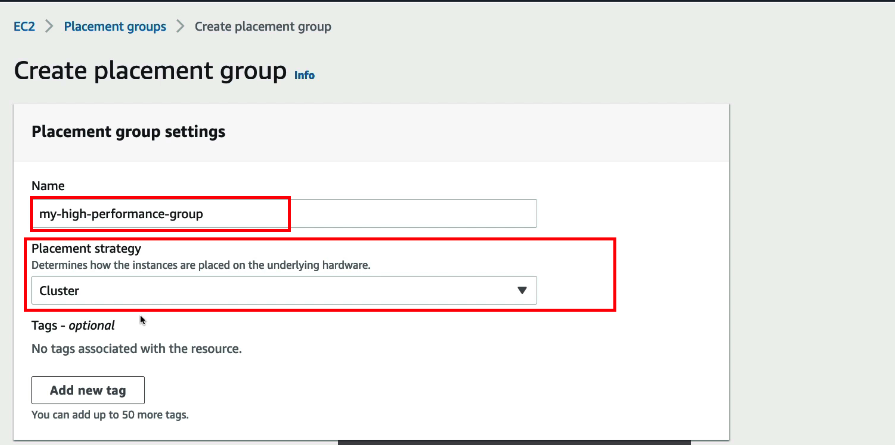
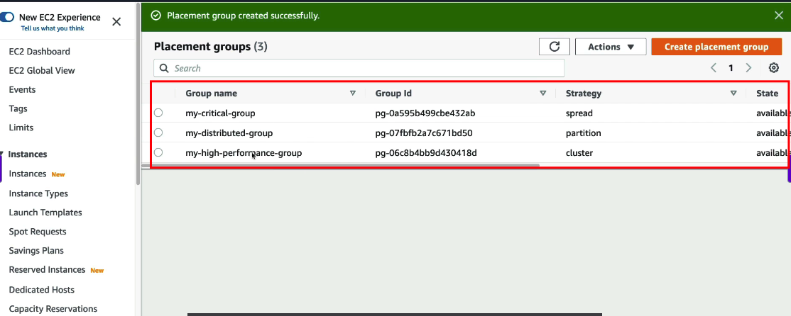

# EC2 Placement Groups - Hands On Guide

## Tổng quan về Placement Groups

Tạo ở trong phần này

- Hiển thị ba loại Placement Groups chính
- So sánh cách phân bố instances trong mỗi loại
- Minh họa mối quan hệ giữa AZ và instances

## Quy trình tạo Placement Group

1. Truy cập AWS Management Console
2. Chọn EC2 Dashboard
3. Chọn "Placement Groups" từ menu bên trái
4. Click "Create Placement Group"
5. Chọn loại Placement Group phù hợp:
   - Cluster
   - Spread
   - Partition   
   Tiến hành tạo loại 1 
6. Đặt tên và mô tả cho Placement Group
7. Xác nhận tạo  
Ta có 3 loại 


## Thêm Instances vào Placement Group

### Trong quá trình tạo instance mới:
1. Chọn "Advanced Details"
2. Tìm phần "Placement Group"
   
3. Chọn Placement Group đã tạo

### Đối với instance hiện có:
1. Stop instance
2. Modify instance settings
3. Chọn Placement Group
4. Start instance

## Kiểm tra và xác minh

### Sử dụng AWS CLI:
```bash
aws ec2 describe-placement-groups
aws ec2 describe-instances --filters "Name=placement-group-name,Values=your-group-name"
```

### Kiểm tra trong AWS Console:
- Xem thông tin Placement Group
- Xác minh vị trí của instances
- Kiểm tra hiệu suất mạng

## Lưu ý quan trọng
- Không thể thay đổi loại Placement Group sau khi tạo
- Không thể di chuyển instance giữa các Placement Group
- Cần tuân thủ giới hạn về số lượng instances
- Đảm bảo AZ phù hợp với yêu cầu 